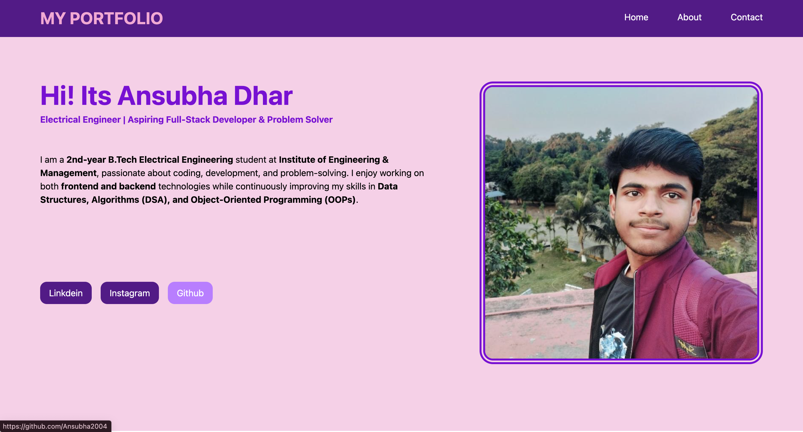

# Portfolio Static Page
<h3>Created using React.js & TailwindCSS</h3>
<h3><b>Preview:-</b></h3>

<b>Description:-</b> This is a demo sample portfolio page to learn and explore React.js and tailwindcss

<b>React Documentation:-</b> <a href="https://react.dev/">Click Here</a>

<b>Tailwind Documentation:-</b> <a href="https://tailwindcss.com/docs/installation/using-vite">Click Here</a>

